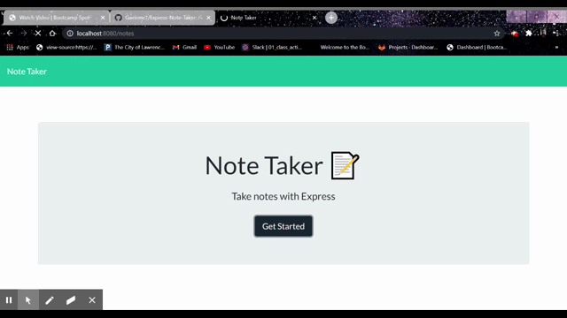

# Express Note Taker

  ## Description 
  
  An application that can be used to write, save, and delete notes. This application will use an express backend and save and retrieve note data from a JSON file.

  ## Table of Contents
    * [Usage](#usage)
  * [License](#license)
  
  ## Usage 
  
  *Instructions and examples for use:*
  
  run 'node server.js' to start the application.
  
  ## License
  
  MIT
  
  ---
  
  ## Questions? 
  
  Contact me with any questions using the information below:
 
  GitHub: [@Gavinmr1](https://api.github.com/users/Gavinmr1)
  